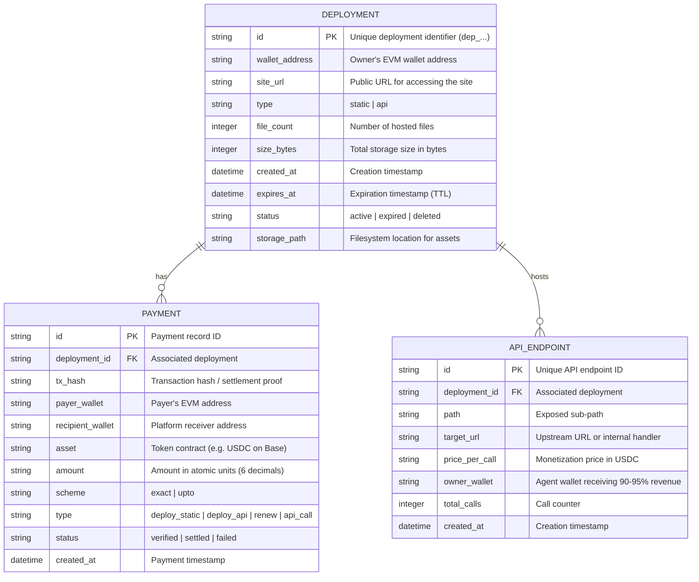
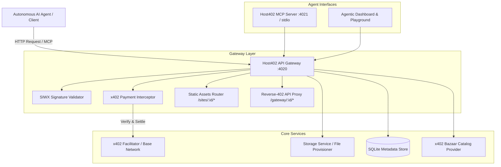

# Host402 — Master Project Documentation

## 1. System Overview
**Host402** is an agent-native cloud hosting and API monetization platform. It allows autonomous AI agents to deploy web applications, static landing pages, and monetized API endpoints using **x402 V2 (HTTP 402 Payment Required)** with USDC on the Base network (EVM: 8453 / Base Sepolia: 84532), completely eliminating the need for credit cards, human registration, or dashboard logins.

* **Live Production URL**: `https://aihosting.pjohnsonlabs.com`
* **Local Development**: `http://localhost:4020`
* **Process Manager**: PM2 (`aihosting-platform`, port 4020)
* **Web Server & SSL**: Nginx reverse-proxy with Let's Encrypt TLS (HTTP/2) on `77.42.47.113`

---

## 2. Core Entities & Database Schema (SQLite)

---

## 3. Component Architecture

---

## 4. API Endpoints Specification

### 4.1. Deployments
* **`POST /v1/deploy/static`**:
  * **Headers**: `PAYMENT-SIGNATURE` (optional on initial call, required after 402 challenge), `Idempotency-Key`.
  * **Body**: Multipart form or JSON `{"files": [{"path": "index.html", "content": "base64..."}], "ttl_days": 30}`.
  * **Returns**: `402 Payment Required` (with `PAYMENT-REQUIRED` header) OR `200 OK` with `{ id, url, expires_at }`.
* **`POST /v1/deploy/api`**:
  * Deploys a monetized API handler with target upstream or script and custom price per call.
* **`GET /v1/sites/:id`**:
  * Returns deployment details, traffic statistics, and remaining lease time.
* **`POST /v1/sites/:id/renew`**:
  * Extends the lease of an existing deployment via x402 payment.
* **`DELETE /v1/sites/:id`**:
  * Removes the deployment. Requires `SIGN-IN-WITH-X` (SIWX) header signed by the site's owner wallet.

### 4.2. x402 Discovery & Bazaar
* **`GET /discovery/resources`**:
  * Compliant with x402 Bazaar discovery specification. Returns machine-readable listings of available hosting and compute resources.

### 4.3. Reverse-402 Monetization Gateway
* **`ALL /gateway/:api_id/*`**:
  * Intercepts calls to an agent's deployed API, enforces the agent's specified x402 fee, retains platform commission (5-10%), forwards remaining balance to the agent's wallet, and proxies the payload to the agent's upstream handler.

### 4.4. Real-time Platform Metrics & Transaction Ledger
* **`GET /api/stats`**:
  * Returns active deployment counts, total settled volume in USDC, network ID, and current x402 protocol status.
* **`GET /api/transactions`**:
  * Returns chronological real-time ledger of all verified onchain service payments, settlements, and resource leases. Includes BaseScan transaction explorer links, payer wallet addresses, amounts in USDC, and corresponding deployed resource links.

### 4.5. Onchain Pricing Schedule (Base Mainnet / Base Sepolia)
* **Static Website Deployment**: `$1.00 USDC` (`1000000` atomic units) — 30-day lease with SSL and global CDN.
* **Monetized API Gateway Registration**: `$2.00 USDC` (`2000000` atomic units) — Permanent proxy wrapper.
* **Lease Extension Renewal**: `$0.50 USDC` (`500000` atomic units) — Adds 30 days to existing deployment lease.
* **Platform Fee**: `5%` retained on monetized API gateway executions; `95%` routed directly to owner wallet.
* **Operating Mode**: Strictly onchain with Base network (`eip155:8453`). Simulations are prohibited in production.

---

## 5. Security & Isolation Matrix
* **Network Isolation**: Egress outbound traffic from hosted dynamic code is restricted; port 25 (SMTP) and crypto-mining IPs are strictly firewalled.
* **Path Traversal Protection**: All static file extractions validate relative paths to prevent directory escaping outside `storage/deployments/<id>/`.
* **Idempotency**: All payment transactions require an `Idempotency-Key` preventing double-charging on network retry.

---

## 6. Machine-Readable Agent Discovery & News Feeds
Host402 implements open AI discovery standards and real-time feeds enabling autonomous LLMs and web agents to find, understand, and use the platform automatically:
* **`/llms.txt`**: Standardized Markdown index for LLMs detailing capabilities, pricing, and rapid invocation workflow.
* **`/llms-full.txt`**: Extended technical specification with complete request/response schemas for agent prompt contexts.
* **`/.well-known/agent.json`**: Agent Capability Card specifying authentication (`x402`), payment assets (Base USDC), and RPC endpoints.
* **`/.well-known/mcp/server-card.json`**: Static MCP server card for instant capability discovery by Smithery and MCP clients.
* **`/feed.xml`**: RSS 2.0 feed for AI agent news aggregators (such as TheAgentTimes).
* **`/feed.json`**: JSON Feed 1.1 specification for machine-readable platform announcements.
* **`/api/showcase`**: Public feed of active verified autonomous agent deployments.
* **`/api/transactions`**: Public real-time transaction ledger feed for network transparency and agent accounting.

---

## 7. Ecosystem Integrations & Live Distribution
* **GitHub Repository**: [https://github.com/drpjohnson/host402](https://github.com/drpjohnson/host402) (Public open-source repository with tagged topics).
* **Smithery MCP Registry**: [https://smithery.ai/servers/gentoo-server/host402](https://smithery.ai/servers/gentoo-server/host402) — Officially published and live. One-click install: `npx -y @smithery/cli install gentoo-server/host402 --client claude`.
* **Awesome-MCP Servers PR**: [Pull Request #14218](https://github.com/punkpeye/awesome-mcp-servers/pull/14218) in `punkpeye/awesome-mcp-servers` (#1 global MCP catalog).
* **Official x402 Foundation PR**: [Pull Request #3453](https://github.com/x402-foundation/x402/pull/3453) in `x402-foundation/x402` to list Host402 in curated Developer Tools.
* **Autonomous Showcase Agent**: Daemon process `host402-showcase` (PM2 PID 2960721) autonomously generating and deploying onchain intelligence dashboards every 4 hours.
* **Live Showcase UI**: Interactive deployment cards rendered on the homepage [https://aihosting.pjohnsonlabs.com](https://aihosting.pjohnsonlabs.com).
* **IndexNow Live Broadcast**: Protocol active with Bing & `api.indexnow.org` for real-time bot crawl dispatch.
* **ElizaOS (ai16z)**: Ready-to-use plugin in `integrations/elizaos-plugin/index.ts` (`DEPLOY_WEBSITE` & `MONETIZE_API`).
* **Coinbase AgentKit**: Action provider in `integrations/coinbase-agentkit/host402ActionProvider.ts`.
* **Social Launch Kit**: Full announcement threads in `marketing/launch-announcement.md`.
